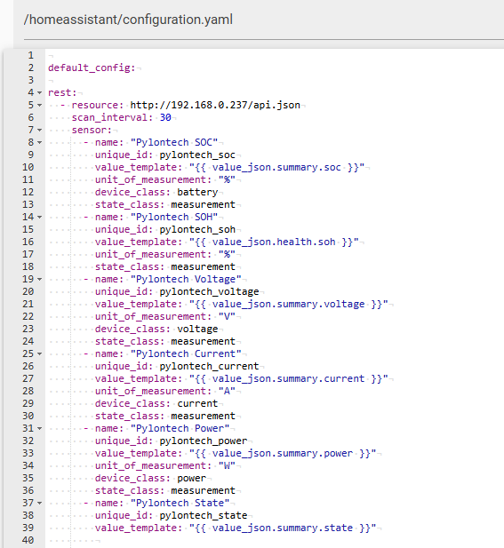
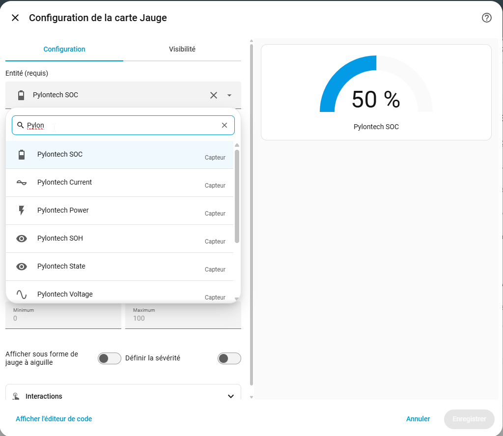

# Pylon-Monitor — Monitoraggio, Diagnostica Pylontech e Integrazione con Home Assistant

[🇬🇧 English](README.md) | [🇫🇷 Français](README.fr.md) | [🇩🇪 Deutsch](README.de.md) | [🇪🇸 Español](README.es.md) | 🇮🇹 Italiano | [🇳🇱 Nederlands](README.nl.md)

**Last updated:** 2026-08-29 20:43:02 UTC

[](https://pylon-monitor.com) [](LICENSE) [](#lingue-disponibili)

> **Pylon-Monitor** è un piccolo dispositivo autonomo per il **monitoraggio delle batterie Pylontech**: un apparecchio WiFi plug & play che legge la porta Console (RS-232) di una batteria al litio Pylontech e trasforma ogni valore — Stato di Carica, Stato di Salute, tensione, corrente, potenza, tensioni per cella, temperature e allarmi — in una **API REST JSON** pulita, una dashboard web in tempo reale e un display TFT integrato. È il modo più rapido per fare **Pylontech Monitor**, **Pylontech Monitoring**, **Pylontech Diagnostics** e **monitoraggio Pylontech wireless / da remoto** — con integrazione nativa con **Home Assistant**, **MQTT**, **Jeedom**, **Node-RED**, **Domoticz** e **openHAB**, configurabile in meno di 2 minuti.

Questo repository è l'hub di documentazione pubblica, riferimento per l'integrazione e risorsa per la community del dispositivo **[Pylon-Monitor](https://pylon-monitor.com)**. **Non** è il firmware né il design hardware del dispositivo — vedi [Cosa contiene (e cosa non contiene) questo repository](#cosa-contiene-e-cosa-non-contiene-questo-repository) più sotto.

<p align="center">
  
</p>

---

## Indice

- [Cos'è Pylon-Monitor?](#cosè-pylon-monitor)
- [Perché Pylon-Monitor — il monitoraggio Pylontech semplificato](#perché-pylon-monitor--il-monitoraggio-pylontech-semplificato)
- [Funzionalità chiave](#funzionalità-chiave)
- [Batterie Pylontech compatibili](#batterie-pylontech-compatibili)
- [Dietro le quinte — progettato per le reali variazioni di firmware Pylontech](#dietro-le-quinte--progettato-per-le-reali-variazioni-di-firmware-pylontech)
- [Avvio rapido — plug & play in meno di 2 minuti](#avvio-rapido--plug--play-in-meno-di-2-minuti)
- [API JSON — recuperare i dati delle batterie Pylontech](#api-json--recuperare-i-dati-delle-batterie-pylontech)
- [Integrazione con Home Assistant (auto-discovery MQTT e REST)](#integrazione-con-home-assistant-auto-discovery-mqtt-e-rest)
- [Integrazione con Jeedom](#integrazione-con-jeedom)
- [Integrazione con Node-RED](#integrazione-con-node-red)
- [Domoticz, openHAB e qualsiasi piattaforma HTTP/JSON](#domoticz-openhab-e-qualsiasi-piattaforma-httpjson)
- [Privacy e sicurezza — 100% locale, zero cloud](#privacy-e-sicurezza--100-locale-zero-cloud)
- [Aggiornamenti firmware](#aggiornamenti-firmware)
- [Domande frequenti](#domande-frequenti)
- [Cosa contiene (e cosa non contiene) questo repository](#cosa-contiene-e-cosa-non-contiene-questo-repository)
- [Lingue disponibili](#lingue-disponibili)
- [Link ufficiali](#link-ufficiali)
- [Licenza](#licenza)

---

## Cos'è Pylon-Monitor?

**Pylon-Monitor** è uno strumento dedicato di **monitoraggio e diagnostica Pylontech** — non un gadget IoT generico, non un sistema di gestione della batteria, e non affiliato né approvato da Pylontech. Si collega alla **porta Console (RS-232) a bassa tensione** di una batteria Pylontech, legge in tempo reale la telemetria interna della batteria e la espone in tre modi contemporaneamente:

1. Una **API REST JSON** (`GET /api.json`) — un'unica chiamata HTTP, l'intero stato della batteria, pronta per qualsiasi script, dashboard o piattaforma domotica.
2. Una **dashboard web in tempo reale**, raggiungibile da qualsiasi browser sulla rete locale — nessuna app da installare.
3. Un **display TFT da 1,8" integrato** sul dispositivo stesso, per una lettura a colpo d'occhio senza nemmeno aprire un laptop.

Se cercavate **Pylontech Monitor**, **Pylontech Monitoring**, **Pylontech Diagnostics**, **come monitorare una batteria Pylontech da remoto**, **Pylontech Home Assistant**, **Pylontech MQTT**, **Pylontech Jeedom**, **recuperare i dati delle batterie Pylontech**, **monitoraggio SOC SOH Pylontech**, o **monitoraggio Pylontech wireless / da remoto**, è esattamente ciò che fa Pylon-Monitor.

## Perché Pylon-Monitor — il monitoraggio Pylontech semplificato

La maggior parte dei modi per leggere lo stato interno di una batteria Pylontech richiede un laptop collegato alla porta Console, con il software del produttore (PYLON Console / BatteryView) avviato manualmente ogni volta che si vuole consultare un dato. **Pylon-Monitor trasforma tutto questo in un servizio permanente, remoto e wireless**:

- **Plug & play in meno di 2 minuti.** Collegate il cavo Console, alimentate il dispositivo, unitevi al suo portale WiFi di configurazione (`PylonMonitor-Setup`), scegliete la vostra rete WiFi domestica. Fatto. Nessuna app, nessun account, nessuna riga di comando, nessuna saldatura.
- **Monitoraggio Pylontech da remoto, sempre attivo.** Una volta configurato, SOC, SOH, tensione, corrente, potenza, temperatura e stato degli allarmi della batteria sono disponibili da qualsiasi punto della vostra rete locale (o da remoto, tramite una vostra VPN / reverse proxy — il dispositivo stesso non dipende da alcun cloud, vedi [Privacy e sicurezza](#privacy-e-sicurezza--100-locale-zero-cloud)).
- **Pensato per l'integrazione, non solo per guardare uno schermo.** L'API JSON e il supporto nativo Home Assistant / MQTT fanno sì che i dati confluiscano direttamente nella vostra soluzione domotica, di monitoraggio energetico o di logging esistente — Home Assistant, Jeedom, Node-RED, Domoticz, openHAB, Grafana, un cron job, uno script shell, qualsiasi cosa in grado di fare una richiesta HTTP GET.
- **Fino a 16 batterie, modelli misti gestiti correttamente.** I sistemi Pylontech concatenati — fino a 16 batterie, es. 16&times; US5000 (&asymp;76,8 kWh) o un mix come US2000 + US3000 + US5000 — vengono rilevati e riportati singolarmente, con il SOC combinato ponderato per capacità tra i modelli anziché mediato in modo ingenuo — a condizione che il cavo RJ45 sia collegato alla porta Console dell'unità master. Il dettaglio della tensione per cella è limitato a 64 letture (le prime ~4 batterie); ogni batteria mantiene comunque tutte le sue letture di SOC/tensione/corrente/potenza/SOH/cicli.

## Funzionalità chiave

| Funzionalità | Descrizione |
|---|---|
| **API REST JSON** | `GET /api.json` restituisce SOC, SOH, tensione, corrente, potenza, stato, tensioni per cella, dettaglio per batteria, temperature, stato WiFi/MQTT e altro come JSON strutturato — nessuna autenticazione richiesta sulla rete locale, pronto per Home Assistant, Node-RED, Jeedom, Domoticz, openHAB o i vostri script. |
| **Home Assistant, auto-discovery MQTT** | Inserite IP e credenziali del vostro broker MQTT e 10 sensori appaiono automaticamente — SOC, SOH, tensione, corrente, potenza, temperatura batteria e MOSFET, cicli, stato e squilibrio celle — raggruppati sotto un'unica scheda dispositivo, più un segnale di disponibilità online/offline. **Zero YAML.** |
| **Dashboard web** | Le schede live si aggiornano ogni pochi secondi senza mai ricaricare la pagina: Carica (SOC, tensione, corrente, potenza, stato), Salute (SOH, cicli, squilibrio celle, contatori carica/scarica), Temperature (base e MOSFET), Sistema (IP, segnale WiFi, stato MQTT, uptime), Celle e grafico storico carica 24h. |
| **Display TFT integrato, autoripristinante** | Uno schermo IPS da 1,8" mostra lo Stato di Carica in cifre enormi, con tensione/corrente accanto e SOH/cicli/temperatura sotto — completamente personalizzabile, e si reinizializza automaticamente così un guasto di alimentazione non lo blocca mai. |
| **Allarmi configurabili (notifiche push)** | Impostate le vostre soglie di SOC e temperatura, con isteresi così una singola lettura anomala non genera spam, e ricevete una notifica push via Pushover non appena una soglia viene superata. |
| **Supporto multi-batteria — fino a 16 batterie** | Fino a 16 batterie concatenate — es. 16&times; US5000 (&asymp;76,8 kWh combinati) o un mix di modelli come US2000 + US3000 + US5000 — rilevate e mostrate singolarmente (SOC, tensione, corrente, potenza, stato, SOH, cicli, temperature), con il SOC combinato ponderato per capacità tra i modelli. Un selettore alterna tra "tutte le batterie combinate" e ogni singola batteria. Collegamento solo alla porta Console dell'unità master. Dettaglio tensione per cella limitato a 64 letture (~prime 4 batterie). |
| **Personalizzazione del display** | Scegliete esattamente quali elementi mostra il display TFT fisico, con anteprima live prima di salvare. |
| **Due livelli di reset** | Una doppia pressione del pulsante di reset riapre solo la configurazione WiFi (nient'altro viene toccato); il Factory reset dalla dashboard cancella tutto (WiFi, MQTT, allarmi, login). |

Elenco completo e illustrato: **[pylon-monitor.com/it/features](https://pylon-monitor.com/it/features)**

<p align="center">
  
  <br><sub>La dashboard web live — nessuna schermata di login predefinita, si aggiorna ogni pochi secondi.</sub>
</p>

<p align="center">
  
  <br><sub>Allarmi SOC/temperatura configurabili — imposta le soglie, aggiungi le tue credenziali Pushover, testa con un clic.</sub>
</p>

## Batterie Pylontech compatibili

Pylon-Monitor funziona con qualsiasi **batteria Pylontech dotata di porta Console/RS-232 a bassa tensione**:

- Pylontech US5000 / US5000C (venduta anche come US5000-1C)
- Pylontech US3000C
- Pylontech US3000
- Pylontech US2000C
- Pylontech US2000B+
- Pylontech UP2500
- Famiglia Pylontech Force-L1

**Non compatibile** con sistemi Pylontech ad alta tensione (Force-H, H48050) o altri marchi di batterie (BYD, Dyness, Seplos, ecc.) — il protocollo e il connettore sono specifici di Pylontech.

**Fino a 16 batterie, modelli misti inclusi.** Un singolo Pylon-Monitor supporta fino a 16 batterie concatenate in totale — ad esempio 16&times; US5000 (&asymp;76,8 kWh combinati), 16&times; US2000 (&asymp;38,4 kWh), o qualsiasi mix come 2&times; US2000 + 2&times; US3000 + 1&times; US5000 sulla stessa catena. Ogni batteria fisica viene interrogata e riportata singolarmente; il SOC combinato è ponderato in base alla capacità propria di ciascuna unità (letta in tempo reale dalla batteria, mai fissata per modello), così un pacco con capacità miste riporta un numero combinato fedele invece di una semplice media tra le unità — vedi [Dietro le quinte](#dietro-le-quinte--progettato-per-le-reali-variazioni-di-firmware-pylontech) qui sotto.

## Dietro le quinte — progettato per le reali variazioni di firmware Pylontech

L'output della console del BMS Pylontech non è perfettamente stabile tra versioni di firmware e modelli — la disposizione esatta delle colonne delle risposte console `pwr`/`bat` può cambiare con un aggiornamento del firmware BMS, anche sullo *stesso* modello di batteria. Non è un'ipotesi: è stato osservato proprio sullo stesso modello US5000 su cui questo progetto viene sviluppato, dove un firmware BMS più recente inserisce quattro colonne diagnostiche aggiuntive prima dei campi di stato di carica e Coulomb (SOC).

Un monitor che presume una posizione di colonna fissa per "SOC" o "carica/scarica" riporterebbe, su quel firmware, un numero completamente sbagliato — nessun errore, nessun avviso, semplicemente un SOC errato. Il firmware di Pylon-Monitor analizza invece la riga di intestazione reale effettivamente inviata dalla batteria a ogni interrogazione, e individua ogni valore **in base al nome**, adattandosi automaticamente alla disposizione usata dal firmware BMS di quella specifica unità. Verificato sia contro il formato di risposta esatto usato in sviluppo, sia contro una risposta con disposizione diversa segnalata sul campo.

Altri due dettagli di affidabilità utili se si sviluppa contro questo dispositivo:

- **SOC combinato ponderato per capacità.** Su un pacco che mescola modelli/capacità di batteria (es. US2000 + US3000 + US5000), la percentuale di carica combinata è ponderata in base alla capacità nominale propria di ciascuna unità — letta in tempo reale dalla risposta `info` della batteria, mai fissata per modello — anziché una semplice media, che sottorappresenterebbe le unità più grandi.
- **Diagnostica in streaming, non bufferizzata.** La vista diagnostica `/raw` (risposte console esatte, non elaborate) viene trasmessa al browser pezzo per pezzo invece di essere assemblata prima in RAM. Su un ESP8266 (&asymp;80 KB di RAM totale), costruire una pagina di diversi kilobyte in un unico buffer prima dell'invio è un reale rischio di guasto sotto pressione di memoria, specialmente quando cresce il numero di batterie concatenate. Lo streaming mantiene costante l'impronta di memoria di quella pagina, indipendentemente dalla lunghezza della catena.

Nulla di tutto ciò riguarda solo la precisione di `/api.json` su un piccolo banco di prova — è esattamente il motivo per cui lo stesso firmware funziona correttamente sia con 1 batteria sia con una catena completa di 16 unità, e indipendentemente dal fatto che ogni unità sia dello stesso modello o meno.

## Avvio rapido — plug & play in meno di 2 minuti

Pylon-Monitor è progettato in modo che **chiunque possa configurarlo in meno di due minuti**, senza app, senza account e senza riga di comando:

1. **Collegate** il cavo Console in dotazione tra il Pylon-Monitor e la porta Console (RS-232) della vostra batteria Pylontech.
2. **Alimentate** il dispositivo — il display TFT si accende e il dispositivo si avvia in modalità configurazione WiFi.
3. **Unitevi** alla rete WiFi temporanea che trasmette (`PylonMonitor-Setup`) dal vostro telefono o laptop.
4. **Scegliete** la vostra rete WiFi domestica e inserite la password nel portale captivo che si apre automaticamente.
5. **Fatto.** Il dispositivo si riavvia sulla vostra rete, il display TFT mostra il nuovo indirizzo IP, e la dashboard è attiva su `http://<ip-dispositivo>` o `http://pylon-monitor.local`.

Nessun flashing del firmware, nessun driver, nessuna app di terze parti richiesta per questo passaggio. Guida condensata: **[pylon-monitor.com/it/quickstart](https://pylon-monitor.com/it/quickstart)** — guida completa passo-passo e risoluzione dei problemi: **[pylon-monitor.com/it/installation](https://pylon-monitor.com/it/installation)**.

## API JSON — recuperare i dati delle batterie Pylontech

Il cuore di ogni integrazione è un unico endpoint:

```
GET http://<ip-dispositivo>/api.json
```

- Nessuna autenticazione richiesta sulla rete locale — progettato per essere interrogato da piattaforme domotiche e script.
- Nessun andirivieni verso il cloud — la risposta arriva direttamente dal dispositivo, che l'ha letta direttamente dalla porta Console della batteria.
- Restituisce lo stato completo della batteria come JSON strutturato: riepilogo carica, salute, tensioni per cella, dettaglio per batteria (per sistemi concatenati), temperature, segnale WiFi, stato connessione MQTT e altro.

Estratto illustrativo (vedi [`examples/api-response-example.json`](examples/api-response-example.json)):

```json
{
  "summary": {
    "soc": 87,
    "voltage": 52.3,
    "current": -4.1,
    "power": -214,
    "state": "discharging"
  },
  "health": {
    "soh": 98
  },
  "net": {
    "rssi": -52
  }
}
```

Qualsiasi strumento capace di fare una richiesta HTTP GET e analizzare JSON può usarlo — un cron job con `curl` + `jq`, uno script Python/Node, Grafana tramite la sorgente dati JSON API, o qualsiasi piattaforma domotica. Vedete la risposta completa e ogni campo sulla dashboard del dispositivo, o gli screenshot annotati su **[pylon-monitor.com/it/tour](https://pylon-monitor.com/it/tour)**.

## Integrazione con Home Assistant (auto-discovery MQTT e REST)

Pylon-Monitor è costruito per l'**integrazione Home Assistant Pylontech** fin da subito — entrambi i metodi sono integrati direttamente nel firmware: **niente HACS, nessun componente personalizzato, nessun componente aggiuntivo da installare lato Home Assistant.**

### Opzione 1 — Auto-discovery MQTT (consigliata)

Se utilizzate già il componente aggiuntivo *Mosquitto / MQTT broker* in Home Assistant: inserite IP, porta, nome utente e password nella pagina Settings del dispositivo. Il dispositivo pubblica quindi configurazioni di discovery standard di Home Assistant, e **10 sensori appaiono automaticamente** in **Impostazioni → Dispositivi e servizi → MQTT**, raggruppati sotto un'unica scheda dispositivo chiamata *Pylon-Monitor*:

| Sensore | Topic di discovery |
|---|---|
| SOC batteria | `homeassistant/sensor/pylon-monitor/soc/config` |
| SOH batteria | `homeassistant/sensor/pylon-monitor/soh/config` |
| Tensione batteria | `homeassistant/sensor/pylon-monitor/voltage/config` |
| Corrente batteria | `homeassistant/sensor/pylon-monitor/current/config` |
| Potenza batteria | `homeassistant/sensor/pylon-monitor/power/config` |
| Temperatura batteria | `homeassistant/sensor/pylon-monitor/temp/config` |
| Temperatura MOSFET | `homeassistant/sensor/pylon-monitor/mostemp/config` |
| Cicli di carica | `homeassistant/sensor/pylon-monitor/cycles/config` |
| Stato batteria | `homeassistant/sensor/pylon-monitor/state/config` |
| Squilibrio celle | `homeassistant/sensor/pylon-monitor/celldelta/config` |

Tutti e dieci i sensori condividono un unico topic di stato (`pylon-monitor/state`, con prefisso hostname), e il dispositivo pubblica un topic di **disponibilità** retained (`pylon-monitor/status` → `online` / `offline`) con un vero Last-Will-and-Testament, così ogni sensore si oscura correttamente in Home Assistant se il dispositivo perde alimentazione o WiFi, invece di rimanere silenziosamente bloccato sull'ultimo valore.

### Opzione 2 — REST (nessun broker MQTT necessario)

La piattaforma `rest` integrata di Home Assistant interroga direttamente `/api.json` ogni 30 secondi e crea 6 sensori. Lo YAML viene generato per voi (con l'IP attuale del vostro dispositivo già inserito) nella pagina Settings del dispositivo — vedi [`examples/home-assistant-rest-sensor.yaml`](examples/home-assistant-rest-sensor.yaml) per la forma generica.

<br>
*Incollato così com'è in `configuration.yaml` — il blocco esatto generato dalla pagina Settings, senza modifiche.*

<br>
*Uno dei sensori risultanti (Pylontech SOC) aggiunto a una scheda Gauge — qui in diretta al 50%.*

> Non mescolate l'opzione 1 e l'opzione 2 per lo stesso sensore — otterrete entità duplicate. MQTT copre già tutto ciò che fa REST, e altro (10 sensori contro 6), quindi c'è raramente motivo di usarle entrambe.

Guida completa con screenshot: **[pylon-monitor.com/it/home-assistant](https://pylon-monitor.com/it/home-assistant)**

## Integrazione con Jeedom

**Monitoraggio Pylontech Jeedom** in tre passaggi:

1. Installate il plugin **JSON** dallo store dei plugin Jeedom.
2. Puntate un'apparecchiatura a `http://<ip-dispositivo>/api.json`.
3. Mappate i percorsi JSON sui comandi Jeedom — es. `summary>soc`, `summary>voltage`, `summary>state`, `net>rssi`.

Vedi [`examples/jeedom-json-plugin.md`](examples/jeedom-json-plugin.md) per un esempio dettagliato.

## Integrazione con Node-RED

Usate un nodo **http request** — metodo `GET`, URL `http://<ip-dispositivo>/api.json`, tipo di ritorno *a parsed JSON object* — poi leggete `msg.payload.summary.soc` (o qualsiasi altro campo) più avanti nel flusso. Se MQTT è configurato sul dispositivo, potete anche iscrivervi direttamente a `pylon-monitor/state` con un nodo MQTT-in — nessun polling necessario. Vedi [`examples/node-red-http-request.md`](examples/node-red-http-request.md).

## Domoticz, openHAB e qualsiasi piattaforma HTTP/JSON

Poiché i dati sono JSON semplice, non autenticato, su HTTP locale, **qualsiasi piattaforma capace di interrogare un URL e analizzare JSON può integrare Pylon-Monitor** — i sensori Dummy/Virtual di Domoticz con uno script, il binding HTTP di openHAB, un pannello Grafana con sorgente dati JSON, uno script Python con `requests`, una riga di shell con `curl | jq`, e così via. Nessun SDK proprietario da installare, nessuna chiave API da richiedere.

## Privacy e sicurezza — 100% locale, zero cloud

- **Nessun servizio cloud.** Il dispositivo non "chiama casa", non richiede alcun account, e funziona completamente offline sulla vostra rete locale.
- **Nessuna telemetria, nessun abbonamento.** Acquisto una tantum; il dispositivo non invia dati di utilizzo da nessuna parte.
- **La porta Console è di sola lettura.** Pylon-Monitor *legge* solo la telemetria della batteria — non invia mai comandi di controllo o di carica, quindi non influisce sulla garanzia del produttore Pylontech e non può alterare il comportamento della batteria. È uno strumento di monitoraggio e diagnostica, non un sistema di gestione della batteria (BMS) né un regolatore di carica.
- **Login dashboard opzionale.** La dashboard web non ha una schermata di login predefinita (comodo su una LAN domestica affidabile); una password può essere attivata in Settings per reti condivise o meno affidabili.
- **OTA firmware locale.** Gli aggiornamenti vengono applicati dalla dashboard del dispositivo stesso, non inviati silenziosamente da un cloud del produttore.

## Aggiornamenti firmware

Pylon-Monitor riceve **aggiornamenti firmware gratuiti a vita**: scarica il `.bin` e installalo dalla dashboard web del dispositivo stesso — nessun cavo, nessuno strumento di reflashing. Changelog e istruzioni: **[pylon-monitor.com/it/firmware](https://pylon-monitor.com/it/firmware)**.

**Ultima versione: v2.2** — una revisione di affidabilità multi-firmware/multi-modello. L'analisi delle risposte console ora individua i valori in base al nome della colonna anziché a una posizione fissa (vedi [Dietro le quinte](#dietro-le-quinte--progettato-per-le-reali-variazioni-di-firmware-pylontech) sopra), il SOC combinato sui pacchi a modelli misti è ora ponderato per capacità, e la pagina diagnostica `/raw` è ora sicura in memoria su catene di batterie grandi. Changelog completo: **[pylon-monitor.com/it/firmware#changelog](https://pylon-monitor.com/it/firmware#changelog)**.

## Domande frequenti

**Pylon-Monitor è prodotto o approvato da Pylontech?**
No. Pylon-Monitor è un accessorio di monitoraggio indipendente, di terze parti. "Pylontech" indica il produttore delle batterie; Pylon-Monitor non ne è affiliato.

**Fa decadere la mia garanzia Pylontech?**
No — la porta Console viene usata rigorosamente in sola lettura per il monitoraggio, quindi non influisce sulla garanzia del produttore della batteria.

**Può controllare o caricare la mia batteria?**
No. Pylon-Monitor è unicamente uno strumento di **monitoraggio e diagnostica**. Non invia mai comandi di controllo o di carica — consideratelo un contatore in sola lettura molto capace, non un BMS.

**Ha bisogno del cloud o di un'app?**
No. Configurazione, dashboard e API sono al 100% locali. Nessun account, nessuna app, nessun abbonamento.

**Quali lingue supporta il sito ufficiale?**
Inglese, francese, tedesco, olandese, spagnolo e italiano — vedi [Lingue disponibili](#lingue-disponibili).

Altre domande a cui viene risposto su **[pylon-monitor.com/it/faq](https://pylon-monitor.com/it/faq)**.

## Cosa contiene (e cosa non contiene) questo repository

Questo repository è l'**hub pubblico di documentazione, SEO/discovery e riferimento per l'integrazione** del dispositivo Pylon-Monitor — riepiloghi di installazione, note di integrazione JSON/MQTT/Home Assistant/Jeedom/Node-RED, e link al sito ufficiale.

**Deliberatamente non include** il codice sorgente del firmware del dispositivo, il design interno della scheda/microcontrollore, schemi elettrici, o qualsiasi altro dettaglio hardware/firmware proprietario. Se state cercando questo, non è pubblicato né qui né altrove — sono coperte solo le interfacce pubbliche documentate e stabili (`/api.json`, topic MQTT, dashboard web), che è tutto ciò di cui un'integrazione ha bisogno.

## Lingue disponibili

Il [sito ufficiale](https://pylon-monitor.com) e questo repository sono completamente disponibili in:

| Lingua | Sito | README del repository |
|---|---|---|
| 🇬🇧 English | [pylon-monitor.com](https://pylon-monitor.com) | [README.md](README.md) |
| 🇫🇷 Français | [pylon-monitor.com/fr](https://pylon-monitor.com/fr) | [README.fr.md](README.fr.md) |
| 🇩🇪 Deutsch | [pylon-monitor.com/de](https://pylon-monitor.com/de) | [README.de.md](README.de.md) |
| 🇪🇸 Español | [pylon-monitor.com/es](https://pylon-monitor.com/es) | [README.es.md](README.es.md) |
| 🇮🇹 Italiano | [pylon-monitor.com/it](https://pylon-monitor.com/it) | [README.it.md](README.it.md) |
| 🇳🇱 Nederlands | [pylon-monitor.com/nl](https://pylon-monitor.com/nl) | [README.nl.md](README.nl.md) |

## Link ufficiali

- [Homepage](https://pylon-monitor.com/it) — panoramica prodotto, prezzo, acquisto
- [Funzionalità](https://pylon-monitor.com/it/features) — elenco completo
- [Tour visivo](https://pylon-monitor.com/it/tour) — screenshot reali di ogni schermata, inclusa la risposta dell'API JSON
- [Avvio rapido](https://pylon-monitor.com/it/quickstart) — guida condensata in 5 passaggi
- [Guida all'installazione](https://pylon-monitor.com/it/installation) — configurazione completa e risoluzione dei problemi
- [Integrazione Home Assistant](https://pylon-monitor.com/it/home-assistant) — configurazione dettagliata MQTT/REST, riferimento topic, esempi di payload
- [Firmware](https://pylon-monitor.com/it/firmware) — changelog e istruzioni di aggiornamento
- [FAQ](https://pylon-monitor.com/it/faq)
- [Contatti](https://pylon-monitor.com/it/contact)

## Licenza

I testi e gli esempi di questo repository sono rilasciati sotto [CC BY 4.0](LICENSE) — riutilizzo, adattamento e condivisione liberi con attribuzione. "Pylon-Monitor" e "Pylontech" sono marchi dei rispettivi proprietari; questo repository è una risorsa di documentazione indipendente e non è affiliato a Pylontech.
