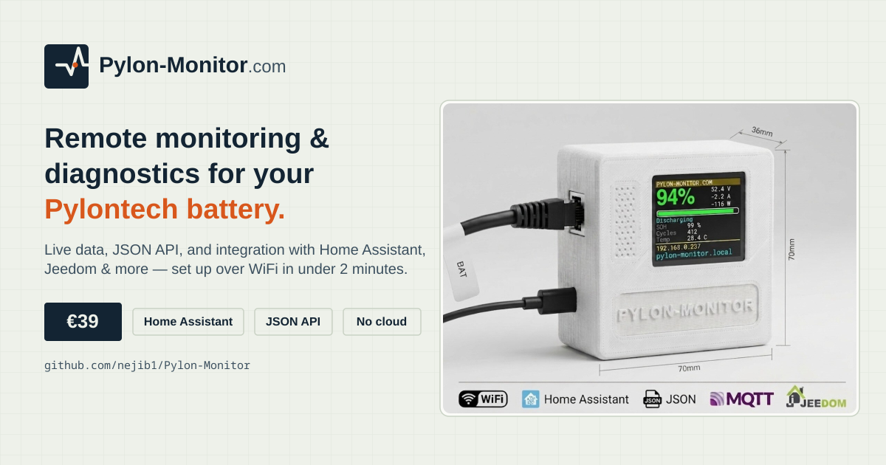

<p align="center">
  <a href="https://pylon-monitor.com"></a>
</p>

# Pylon-Monitor — Pylontech Battery Monitoring, Diagnostics & Home Assistant Integration

🇬🇧 English | [🇫🇷 Français](README.fr.md) | [🇩🇪 Deutsch](README.de.md) | [🇪🇸 Español](README.es.md) | [🇮🇹 Italiano](README.it.md) | [🇳🇱 Nederlands](README.nl.md)

**Last updated:** 2026-09-02 08:20:01 UTC

[](https://pylon-monitor.com) [](LICENSE) [](#-available-languages)

> **Pylon-Monitor** is a small, standalone **Pylontech battery monitor**: a plug-and-play WiFi device that reads the Console (RS-232) port of Pylontech lithium storage batteries and turns every value — State of Charge, State of Health, voltage, current, power, per-cell voltages, temperatures and alarms — into a clean **JSON REST API**, a live web dashboard, and a built-in TFT display. It is the fastest way to do **Pylontech monitoring**, **Pylontech diagnostics**, and **remote / wireless Pylontech battery monitoring** — with native **Home Assistant**, **MQTT**, **Jeedom**, **Node-RED**, **Domoticz** and **openHAB** integration, set up in under 2 minutes.

This repository is the public documentation, integration reference and community resource hub for the [Pylon-Monitor](https://pylon-monitor.com) hardware device. It is **not** the device firmware or hardware design — see [What this repository is (and isn't)](#what-this-repository-is-and-isnt) below.

<p align="center">
  
</p>

---

## Table of contents

- [What is Pylon-Monitor?](#what-is-pylon-monitor)
- [Why Pylon-Monitor — Pylontech Monitoring made simple](#why-pylon-monitor--pylontech-monitoring-made-simple)
- [Key features](#key-features)
- [Compatible Pylontech batteries](#compatible-pylontech-batteries)
- [Under the hood — built for real Pylontech firmware variance](#under-the-hood--built-for-real-pylontech-firmware-variance)
- [Quick start — plug & play in under 2 minutes](#quick-start--plug--play-in-under-2-minutes)
- [JSON REST API — recover your Pylontech battery data](#json-rest-api--recover-your-pylontech-battery-data)
- [Home Assistant integration (MQTT auto-discovery & REST)](#home-assistant-integration-mqtt-auto-discovery--rest)
- [Jeedom integration](#jeedom-integration)
- [Node-RED integration](#node-red-integration)
- [Domoticz, openHAB & any HTTP/JSON platform](#domoticz-openhab--any-httpjson-platform)
- [Privacy & security — 100% local, no cloud](#privacy--security--100-local-no-cloud)
- [Firmware updates](#firmware-updates)
- [Frequently asked questions](#frequently-asked-questions)
- [What this repository is (and isn't)](#what-this-repository-is-and-isnt)
- [Available languages](#available-languages)
- [Official links](#official-links)
- [License](#license)

---

## What is Pylon-Monitor?

**Pylon-Monitor** is a dedicated **Pylontech battery monitoring and diagnostics tool** — not a generic IoT gadget, not a battery management system, and not affiliated with or endorsed by Pylontech. It connects to the low-voltage **Console (RS-232) port** of a Pylontech battery, reads the battery's own internal telemetry in real time, and exposes it three ways at once:

1. A **JSON REST API** (`GET /api.json`) — one HTTP call, the entire battery state, ready for any script, dashboard or home-automation platform.
2. A **live web dashboard**, reachable from any browser on the local network — no app to install.
3. A **built-in 1.8" TFT display** on the device itself, for an at-a-glance reading without even opening a laptop.

If you searched for **Pylontech monitor**, **Pylontech monitoring**, **Pylontech diagnostics**, **how to monitor Pylontech batteries remotely**, **Pylontech Home Assistant**, **Pylontech MQTT**, **Pylontech Jeedom**, **read Pylontech battery data**, **Pylontech SOC SOH monitoring**, or **wireless / remote Pylontech battery monitoring**, this is exactly what Pylon-Monitor does.

## Why Pylon-Monitor — Pylontech monitoring made simple

Most ways of reading a Pylontech battery's internal state require a laptop plugged into the Console port and vendor software (PYLON Console / BatteryView) running interactively, every single time you want a number. **Pylon-Monitor turns that into a permanent, remote, wireless service**:

- **Plug & play in under 2 minutes.** Connect the Console port cable, power the device, join its WiFi setup portal (`PylonMonitor-Setup`), pick your home WiFi network. Done. No app, no account, no command line, no soldering.
- **Always-on remote Pylontech monitoring.** Once configured, the battery's SOC, SOH, voltage, current, power, temperature and alarm state are available from anywhere on your local network (or remotely, through your own VPN / reverse proxy — the device itself has no cloud dependency, see [Privacy & security](#privacy--security--100-local-no-cloud)).
- **Built for integration, not just for looking at a screen.** The JSON API and native Home Assistant / MQTT support mean the data flows straight into your existing home-automation, energy-monitoring or logging stack — Home Assistant, Jeedom, Node-RED, Domoticz, openHAB, Grafana, a cron job, a shell script, anything that can do an HTTP GET.
- **Up to 16 batteries, mixed models handled correctly.** Chained Pylontech systems — up to 16 batteries, e.g. 16&times; US5000 (&asymp;76.8 kWh) or a mix like US2000 + US3000 + US5000 — are detected and reported individually, with the combined SOC capacity-weighted across models rather than naively averaged, provided the RJ45 cable is plugged into the master unit's Console port. Per-cell voltage detail is capped at 64 readings (about the first 4 batteries); every battery still gets full SOC/voltage/current/power/SOH/cycle readings.

## Key features

| Feature | Description |
|---|---|
| **JSON REST API** | `GET /api.json` returns SOC, SOH, voltage, current, power, state, per-cell voltages, per-battery detail, temperatures, WiFi/MQTT status and more as structured JSON — no authentication required on the local network, ready for Home Assistant, Node-RED, Jeedom, Domoticz, openHAB or your own scripts. |
| **Home Assistant, MQTT auto-discovery** | Fill in your MQTT broker's IP and credentials and 10 sensors appear automatically — SOC, SOH, voltage, current, power, battery & MOSFET temperature, cycles, state and cell imbalance — grouped under one device card, plus an online/offline availability signal. **Zero YAML.** |
| **Web dashboard** | Live cards refresh every few seconds without reloading the page: Charge (SOC, voltage, current, power, state), Health (SOH, cycles, cell imbalance, charge/discharge counts), Temperatures (base & MOSFET), System (IP, WiFi signal, MQTT status, uptime), Cells & 24h charge history graph. |
| **Built-in TFT display, self-healing** | A 1.8" IPS screen shows State of Charge in giant digits with voltage/current beside it and SOH/cycles/temperature below — fully customizable, and re-initialised automatically so a power glitch never leaves it stuck. |
| **Configurable alarms (push notifications)** | Set your own SOC and temperature thresholds, with hysteresis so a single noisy reading doesn't spam you, and get a push notification via Pushover the moment either is crossed. |
| **Multi-battery support — up to 16 batteries** | Up to 16 batteries chained together — e.g. 16&times; US5000 (&asymp;76.8 kWh combined) or a mix of models such as US2000 + US3000 + US5000 — each detected and shown individually (SOC, voltage, current, power, state, SOH, cycles, temperatures), with the combined SOC capacity-weighted across models. A selector switches between "all batteries combined" and any single battery. Plug into the master unit's Console port only. Per-cell voltage detail is capped at 64 readings (about the first 4 batteries). |
| **Screen display customization** | Choose exactly which elements the physical TFT shows, with a live preview before saving. |
| **Two levels of reset** | Double-press the reset button to reopen WiFi setup only (nothing else touched); use Factory reset from the dashboard for a clean slate (WiFi, MQTT, alarms, login all wiped). |

Full, illustrated feature list: **[pylon-monitor.com/features](https://pylon-monitor.com/features)**

<p align="center">
  
  <br><sub>The live web dashboard — no login screen by default, refreshes every few seconds.</sub>
</p>

<p align="center">
  
  <br><sub>Configurable SOC/temperature alarms — set thresholds, add your Pushover credentials, test with one click.</sub>
</p>

## Compatible Pylontech batteries

Pylon-Monitor works with any **Pylontech battery that has a low-voltage Console / RS-232 port**:

- Pylontech US5000 / US5000C (also sold as US5000-1C)
- Pylontech US3000C
- Pylontech US3000
- Pylontech US2000C
- Pylontech US2000B+
- Pylontech UP2500
- Pylontech Force-L1 family

**Not compatible** with high-voltage Pylontech systems (Force-H, H48050) or other battery brands (BYD, Dyness, Seplos, etc.) — the protocol and connector are Pylontech-specific.

**Up to 16 batteries, mixed models included.** A single Pylon-Monitor supports up to 16 chained batteries in total — for example 16&times; US5000 (&asymp;76.8 kWh combined), 16&times; US2000 (&asymp;38.4 kWh), or any mix such as 2&times; US2000 + 2&times; US3000 + 1&times; US5000 on the same chain. Every physical battery is queried and reported individually; the combined State of Charge is weighted by each unit's own capacity (read live from the battery, not hardcoded), so a mixed-capacity stack reports an accurate combined number instead of a naive average across units — see [Under the hood](#under-the-hood--built-for-real-pylontech-firmware-variance) below.

## Under the hood — built for real Pylontech firmware variance

Pylontech's BMS console output isn't perfectly stable across firmware versions and models — the exact column layout of the `pwr`/`bat` console replies can change with a BMS firmware update, even on the *same* battery model. This isn't hypothetical: it's been observed on the very same US5000 model this project develops against, where a newer BMS firmware build inserts four extra diagnostic columns before the charge-state and Coulomb (SOC) fields.

A monitor that assumes a fixed column position for "State of Charge" or "charging/discharging" would, on that firmware, silently report a completely wrong number — no error, no warning, just a wrong SOC. Pylon-Monitor's firmware instead parses the real header line the battery actually sends on every poll and locates each value **by name**, self-adjusting to whatever layout that specific unit's BMS firmware uses. Verified against both the exact reply format used in development and a differently laid out reply reported from the field.

Two more reliability details worth knowing if you're building against this device:

- **Capacity-weighted combined SOC.** On a pack mixing battery models/capacities (e.g. US2000 + US3000 + US5000), the combined charge percentage is weighted by each unit's own nominal capacity — read live from the battery's own `info` reply, not hardcoded per model — rather than a plain average, which would under-represent the larger units.
- **Streamed diagnostics, not buffered.** The `/raw` diagnostic view (exact, unparsed console replies) is streamed to the browser piece by piece rather than assembled in RAM first. On an ESP8266 (&asymp;80 KB total RAM), building a multi-kilobyte page in one buffer before sending it is a real failure mode under memory pressure, especially as the number of chained batteries grows. Streaming keeps that page's memory footprint constant regardless of chain length.

None of this only matters for `/api.json` accuracy on a small test rig — it's specifically why the same firmware behaves correctly whether you have 1 battery or a full 16-unit chain, and whether every unit is the same model or not.

## Quick start — plug & play in under 2 minutes

Pylon-Monitor is designed so that **anyone can set it up in under two minutes**, with no app, no account and no command line:

1. **Connect** the supplied Console cable between the Pylon-Monitor device and your Pylontech battery's Console (RS-232) port.
2. **Power** the device — the TFT screen lights up and the device boots into WiFi setup mode.
3. **Join** the temporary WiFi network it broadcasts (`PylonMonitor-Setup`) from your phone or laptop.
4. **Pick** your home WiFi network and enter its password in the captive portal that opens automatically.
5. **Done.** The device reboots onto your network, the TFT shows its new IP address, and the dashboard is live at `http://<device-ip>` or `http://pylon-monitor.local`.

No firmware flashing, no drivers, no third-party app required for this step. Condensed guide: **[pylon-monitor.com/quickstart](https://pylon-monitor.com/quickstart)** — full step-by-step + troubleshooting: **[pylon-monitor.com/installation](https://pylon-monitor.com/installation)**.

## JSON REST API — recover your Pylontech battery data

The core of every integration is one endpoint:

```
GET http://<device-ip>/api.json
```

- No authentication required on the local network — it's designed to be polled by home-automation platforms and scripts.
- No cloud round-trip — the response comes straight from the device, which read it straight from the battery's Console port.
- Returns the full battery state as structured JSON: charge summary, health, per-cell voltages, per-battery breakdown (for chained systems), temperatures, WiFi signal, MQTT connection status, and more.

Illustrative excerpt (see [`examples/api-response-example.json`](examples/api-response-example.json) and the confirmed field paths used throughout the official integration docs):

```json
{
  "summary": {
    "soc": 87,
    "voltage": 52.3,
    "current": -4.1,
    "power": -214,
    "state": "discharging"
  },
  "health": {
    "soh": 98
  },
  "net": {
    "rssi": -52
  }
}
```

Any tool that can do an HTTP GET and parse JSON can use this — a cron job with `curl` + `jq`, a Python/Node script, Grafana via the JSON API data source, or any home-automation platform. See the full response and every field on the device's own dashboard, or the annotated screenshots at **[pylon-monitor.com/tour](https://pylon-monitor.com/tour)**.

## Home Assistant integration (MQTT auto-discovery & REST)

Pylon-Monitor is built for **Home Assistant Pylontech integration** out of the box — both methods are baked into the firmware itself: **no HACS, no custom component, no add-on to install on the Home Assistant side.**

### Option 1 — MQTT auto-discovery (recommended)

If you already run the *Mosquitto / MQTT broker* add-on in Home Assistant: enter its IP, port, username and password in the device's Settings page. The device then publishes standard Home Assistant discovery configs, and **10 sensors appear automatically** under **Settings → Devices & Services → MQTT**, grouped under one device card named *Pylon-Monitor*:

| Sensor | Discovery topic |
|---|---|
| Battery SOC | `homeassistant/sensor/pylon-monitor/soc/config` |
| Battery SOH | `homeassistant/sensor/pylon-monitor/soh/config` |
| Battery voltage | `homeassistant/sensor/pylon-monitor/voltage/config` |
| Battery current | `homeassistant/sensor/pylon-monitor/current/config` |
| Battery power | `homeassistant/sensor/pylon-monitor/power/config` |
| Battery temperature | `homeassistant/sensor/pylon-monitor/temp/config` |
| MOSFET temperature | `homeassistant/sensor/pylon-monitor/mostemp/config` |
| Charge cycles | `homeassistant/sensor/pylon-monitor/cycles/config` |
| Battery state | `homeassistant/sensor/pylon-monitor/state/config` |
| Cell imbalance | `homeassistant/sensor/pylon-monitor/celldelta/config` |

All ten sensors share one state topic (`pylon-monitor/state`, hostname-prefixed) and the device publishes a retained **availability** topic (`pylon-monitor/status` → `online` / `offline`) with a proper Last-Will-and-Testament, so every sensor greys out correctly in Home Assistant if the device loses power or WiFi instead of silently freezing on its last value.

### Option 2 — REST (no MQTT broker needed)

Home Assistant's built-in `rest` platform polls `/api.json` directly every 30 seconds and creates 6 sensors. The YAML is generated for you (with your device's current IP pre-filled) on the device's own Settings page — see [`examples/home-assistant-rest-sensor.yaml`](examples/home-assistant-rest-sensor.yaml) for the generic form.

<br>
*Pasted straight into `configuration.yaml` — the exact block from the Settings page, no edits needed.*

<br>
*One of the resulting sensors (Pylontech SOC) added to a Gauge card — live at 50% here.*

> Don't mix option 1 and option 2 for the same sensor — you'll get duplicate entities. MQTT already covers everything REST does, and more (10 sensors vs. 6), so there's rarely a reason to use both.

Full walkthrough with screenshots: **[pylon-monitor.com/home-assistant](https://pylon-monitor.com/home-assistant)**

## Jeedom integration

**Pylontech Jeedom monitoring** in three steps:

1. Install the **JSON** plugin from the Jeedom plugin store.
2. Point an equipment at `http://<device-ip>/api.json`.
3. Map JSON paths to Jeedom commands — e.g. `summary>soc`, `summary>voltage`, `summary>state`, `net>rssi`.

See [`examples/jeedom-json-plugin.md`](examples/jeedom-json-plugin.md) for a worked example.

## Node-RED integration

Use an **http request** node — method `GET`, URL `http://<device-ip>/api.json`, return type *a parsed JSON object* — then read `msg.payload.summary.soc` (or any other field) downstream. If MQTT is configured on the device, you can also subscribe directly to `pylon-monitor/state` with an MQTT-in node — no polling required. See [`examples/node-red-http-request.md`](examples/node-red-http-request.md).

## Domoticz, openHAB & any HTTP/JSON platform

Because the data is plain, unauthenticated JSON over local HTTP, **any platform that can poll a URL and parse JSON can integrate Pylon-Monitor** — Domoticz's Dummy/Virtual sensors with a script, openHAB's HTTP binding, a Grafana JSON datasource panel, a Python script with `requests`, a shell one-liner with `curl | jq`, and so on. There is no vendor SDK to install and no API key to request.

## Privacy & security — 100% local, no cloud

- **No cloud service.** The device does not phone home, does not require an account, and works fully offline on your local network.
- **No telemetry, no subscription.** One-time purchase; the device does not report usage data anywhere.
- **Console port is read-only.** Pylon-Monitor only *reads* battery telemetry — it never sends control or charging commands, so it does not affect the Pylontech manufacturer's warranty and cannot alter battery behaviour. It is a monitoring and diagnostics tool, not a battery management system (BMS) or charge controller.
- **Optional dashboard login.** The web dashboard has no login screen by default (convenient on a trusted home LAN); a password can be enabled in Settings for shared or less-trusted networks.
- **Local firmware OTA.** Updates are applied from the device's own dashboard, not pushed silently from a vendor cloud.

## Firmware updates

Pylon-Monitor receives **free lifetime firmware updates**: download the `.bin` and install it from the device's own web dashboard — no cables, no re-flashing tools. Changelog and update instructions: **[pylon-monitor.com/firmware](https://pylon-monitor.com/firmware)**.

**Latest: v2.2** — a cross-firmware/cross-model reliability pass. Console reply parsing now locates values by column name instead of a fixed position (see [Under the hood](#under-the-hood--built-for-real-pylontech-firmware-variance) above), the combined SOC on mixed-model packs is now capacity-weighted, and the `/raw` diagnostic page is now memory-safe on large battery chains. Full changelog: **[pylon-monitor.com/firmware#changelog](https://pylon-monitor.com/firmware#changelog)**.

## Frequently asked questions

**Is Pylon-Monitor made or endorsed by Pylontech?**
No. Pylon-Monitor is an independent, third-party monitoring accessory. "Pylontech" refers to the battery manufacturer; Pylon-Monitor is unaffiliated.

**Does it void my Pylontech warranty?**
No — the Console port is used strictly read-only for monitoring, so it does not affect the battery manufacturer's warranty.

**Can it control or charge my battery?**
No. Pylon-Monitor is a **monitoring and diagnostics** tool only. It never sends control or charging commands — think of it as a very capable read-only meter, not a BMS.

**Does it need the cloud or an app?**
No. Setup, the dashboard and the API are all 100% local. No account, no app, no subscription.

**Which languages does the official site support?**
English, French, German, Dutch, Spanish and Italian — see [Available languages](#available-languages).

More questions answered at **[pylon-monitor.com/faq](https://pylon-monitor.com/faq)**.

## What this repository is (and isn't)

This repository is the **public documentation, SEO/discovery hub and integration reference** for the Pylon-Monitor device — installation summaries, JSON/MQTT/Home Assistant/Jeedom/Node-RED integration notes, and links to the official site.

It intentionally **does not** include the device firmware source code, the internal board/microcontroller design, schematics, or any other proprietary hardware/firmware detail. If you're looking for those, they aren't published here or anywhere else — only the documented, stable, public interfaces (`/api.json`, MQTT topics, the web dashboard) are covered, which is everything an integration needs.

## Available languages

The [official site](https://pylon-monitor.com) and this repository are fully available in:

| Language | Site | Repo README |
|---|---|---|
| 🇬🇧 English | [pylon-monitor.com](https://pylon-monitor.com) | [README.md](README.md) |
| 🇫🇷 Français | [pylon-monitor.com/fr](https://pylon-monitor.com/fr) | [README.fr.md](README.fr.md) |
| 🇩🇪 Deutsch | [pylon-monitor.com/de](https://pylon-monitor.com/de) | [README.de.md](README.de.md) |
| 🇪🇸 Español | [pylon-monitor.com/es](https://pylon-monitor.com/es) | [README.es.md](README.es.md) |
| 🇮🇹 Italiano | [pylon-monitor.com/it](https://pylon-monitor.com/it) | [README.it.md](README.it.md) |
| 🇳🇱 Nederlands | [pylon-monitor.com/nl](https://pylon-monitor.com/nl) | [README.nl.md](README.nl.md) |

## Official links

- [Homepage](https://pylon-monitor.com) — product overview, pricing, purchase
- [Features](https://pylon-monitor.com/features) — full feature list
- [Visual tour](https://pylon-monitor.com/tour) — real screenshots of every screen, including the JSON API response
- [Quick start](https://pylon-monitor.com/quickstart) — condensed 5-step setup
- [Installation guide](https://pylon-monitor.com/installation) — full setup & troubleshooting
- [Home Assistant integration](https://pylon-monitor.com/home-assistant) — detailed MQTT/REST setup, topic reference, payload examples
- [Firmware](https://pylon-monitor.com/firmware) — changelog & update instructions
- [FAQ](https://pylon-monitor.com/faq)
- [Contact](https://pylon-monitor.com/contact)

## License

The text and examples in this repository are released under [CC BY 4.0](LICENSE) — reuse, adapt and share freely with attribution. "Pylon-Monitor" and "Pylontech" are trademarks of their respective owners; this repository is an independent documentation resource and is not affiliated with or endorsed by Pylontech.
